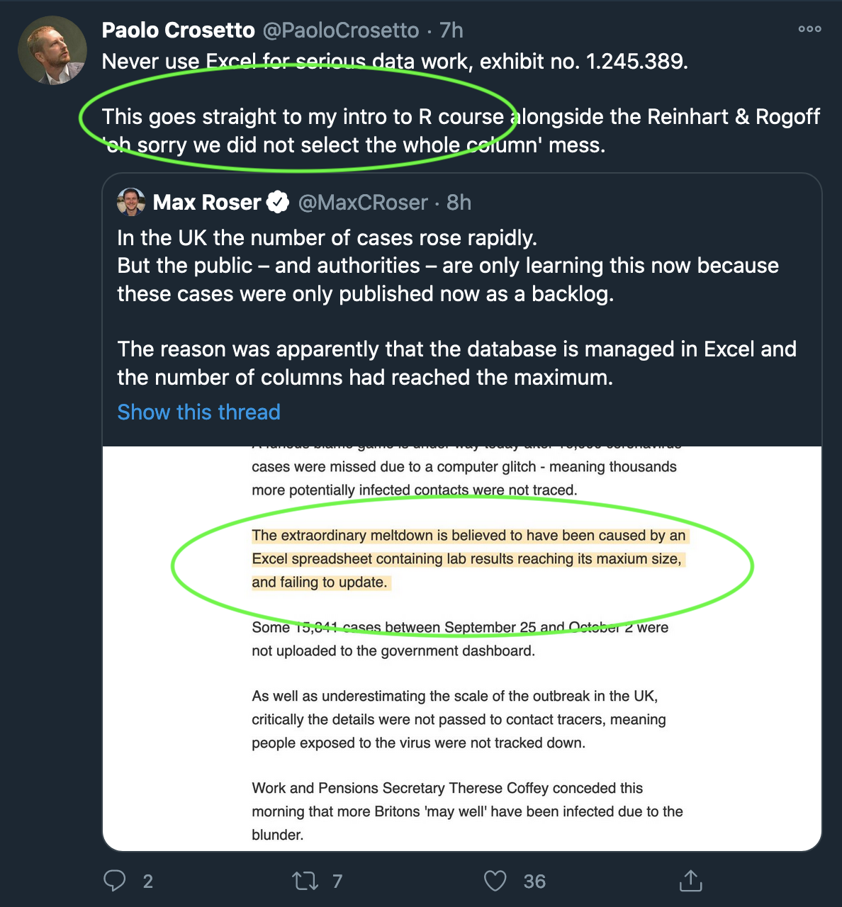

# SOC4001 Procesamiento avanzado de bases de datos en `R`
Este repositorio contiene el material del curso SOC4001 Procesamiento Avanzado de Bases de Datos en R, dictado el segundo semestre 2022 por el Departamento de Sociología de la Universidad Católica de Chile a estudiantes de educación continua como parte del [`[Diplomado en Procesamiento y Análisis de Datos Sociales]`](https://educacioncontinua.uc.cl/41343-ficha-diplomado-en-procesamiento-y-analisis-de-datos-sociales) y del nuevo [`[Diplomado en WebScraping y visualización de datos sociales en R]`](https://educacioncontinua.uc.cl/43873-ficha-diplomado-en-webscraping-y-visualizacion-de-datos-sociales-en-r). Para mayores detalles ver el [`[programa]`](files/syllabus_soc4001.pdf) del curso.

Encuentra también aquí una presentación sobre el rol de `R` como *lingua franca* de la ciencia de datos: [`[Slides]`](https://mebucca.github.io/dar_soc4001/slides/presentation/presentation#1) [`[.Rmd]`](slides/presentation/presentation.Rmd). 

---
## Calendario

clase tipo: T (téorica), P (práctica)

Nota: Todas las clases serán grabadas y estarán disponibles por 7 días. El link de Zoom correspondiente a cada clase se encuentra en la tabla a continuación. Una vez realizada la clase el link a la reunión de Zoom será reemplazado por un link a la grabación de la clase. 

| dia  | mes  | tipo  | contenido                                                               | funciones                                                                                                       | entrega  | link/grabación zoom                                                                                | material                                                                                                                                                                                                                                     |
| ---: | ---: | :---- | :---------------------------------------------------------------------- | :-------------------------------------------------------------------------------------------------------------- | :------- | :-----------------------------------------------                                                   | :--------------------------- 
| 30   | 8    | T     | Introducción a R base y Rstudio                                              | `install.packages()` `library()` `setwd()` `c()` `seq()` `rep()` `sample()`                                     |          | [`[Todos]`](https://puc.zoom.us/rec/play/xJoO0RWMrmxX_OrQ6ow0_JTPp2Ybjmqct6qI0IB6_qxeg9P1Ccb6PiXT1NfA2eclj1rN4X9-fi8b7gwf.l4N-2FW3pJ87Geui?continueMode=true&_x_zm_rtaid=lXAg96GJSaGCfp7jdyGJGQ.1661955083378.8d2340f17a2904f095e8be692b22ab9b&_x_zm_rhtaid=109)                                                                                      | [`[Slides]`](https://mebucca.github.io/dar_soc4001/slides/class_1/class_1#1) [`[.Rmd]`](slides/class_1/class_1.Rmd)                                                                                                                          |
| 1    | 9    | T     | Introducción a bases de datos en R                                      | `data.frame()` `list()` `summary()` `table()` `for()` `plot()`                                                  |          | [`[Todos]`](https://puc.zoom.us/rec/play/esgn-jJ1E7FL7qcrDARO6cI3xog-vk-kc3HvG4Za-h95Ewh3-SyO_rNJSuUprUiCFVSq0PTYvge5xLFk.6Bqxe-J9VA4Mf0sf?continueMode=true&_x_zm_rtaid=pOYnpNx6SEi2Jy4_7YVm8A.1662124066643.7480cd2fcf7623e622a0d86260c135ca&_x_zm_rhtaid=471)                                                                                      | [`[Slides]`](https://mebucca.github.io/dar_soc4001/slides/class_2/class_2#1) [`[.Rmd]`](slides/class_2/class_2.Rmd)                                                                                                                          |
| 6    | 9    | P     | R base y bases de datos en R (CASEN 2020)                         | Todo lo anterior                                             |          | [`[G1]`](https://puc.zoom.us/rec/share/QVlftzZIJRGn6QhvtEPn9zULnGVlbbHOV6hRUAjM9dEYWULs5ytwtyJuNxYXaM7V.rq32AtbX0jj-Ru1w)   [`[G2]`](https://puc.zoom.us/rec/share/yd5aMcyhdefrTTN0J-S9qez6mKhXZlJQ73bYm9A7CIy4YuDgyl9UbqHVjNMSMM4-.xa3oUO7oWMSBaOeC) [`[G3]`](https://puc.zoom.us/j/86505510028?pwd=QURDejdaTThybzhnM1JGR1lRNDE4dz09)                                                              | [`[RScript]`](slides/class_3/class_3.R)  [`[Casen2020]`](http://observatorio.ministeriodesarrollosocial.gob.cl/encuesta-casen-en-pandemia-2020)                                                                                              |
| 8    | 9    | T     | Workflow                                                               | Todo lo anterior                                                                                                | T1       | [`[Todos]`](https://puc.zoom.us/rec/play/fUQOBpgaR8JfX1kqttpQbGzR3jBz2Oa0uKB7lfOwAbA83nyuxjckUT48siaxA2F464Y7fgQg6RwDkI43.ZcWPJmOJw4bhGAo9?continueMode=true&_x_zm_rtaid=v56x1NU5RlSztPdY8xbS8A.1663071028373.4aafa3b6093865e56601934df6224d1c&_x_zm_rhtaid=314)                                                                                      | [`[Archivos]`](slides/class_4/workflow.zip)                                                                                                                                                                                                     |
| 13    | 9    | P     | Workflow                                                                | Todo lo anterior                                                                                                |          | [`[G1]`](https://puc.zoom.us/rec/share/DNIyA14-mruDWhvu3AQB0Dp9RtFTfkRFaMfO-ASZM8w_N00H7N8gQoCDY0DdNfej.9hkE74uikdcN1Luz) [`[G2]`](https://puc.zoom.us/rec/share/B9pNCzTDMhoeiqVZFqiTQcVJwuYBgygF4Q7E1JCtqkVFC6H3aC02RVoUeOyV-skk.kUO_2L8hc-eJEAKv) [`[G3]`](https://puc.zoom.us/j/86562029910)                                                                   | [`[Archivos]`](slides/class_4/workflow_ta.zip)                                                                                                                                                                                                  |
| 15   | 9    | T     | `tidyverse`, pipes y funciones básicas con `dplyr`                      | `readr()` `tibble()` `%>%` `arrange()` `select()` `filter()`                                                    |          | [`[Todos]`](https://puc.zoom.us/rec/play/wuAYQO1FVSp96mTlB9fw5SvqXhHzAIz9f8v5zrh21GDJ5LfaWrS0I8V_2Nzs3OsadDKc9bjPUsiagGFQ.OC__el7T8MhVLRPO?continueMode=true&_x_zm_rtaid=yXi6w6p2QpuvJJPw5nErhg.1663678039515.2d3d11a48f725daf4c7f6f36218779c5&_x_zm_rhtaid=175)                                                                                      | [`[Slides]`](https://mebucca.github.io/dar_soc4001/slides/class_5/class_5#1) [`[.Rmd]`](slides/class_5/class_5.Rmd)                                                                                                                          |
| 20   | 9    | P     | `tidyverse`, pipes y funciones básicas con `dplyr`                      | `readr()` `tibble()` `%>%` `arrange()` `select()` `filter()`                                                    |          | [`[G1]`](https://puc.zoom.us/rec/share/HlZVcnSKTgsmqlFBrQkNMqr1-igPNpPbQry6-nLC7nQtF9OMUqIwycP_Cjhqlk-T.IXFWmQKS28tFhVgs) [`[G2]`](https://puc.zoom.us/j/88268681379) [`[G3]`](https://puc.zoom.us/j/86562029910) |  [`[RScript]`](slides/class_5/class_5.R) [`[Data]`](https://github.com/mebucca/dar_soc4001/blob/master/slides/class_6/sample_casen2017.csv)                                                                                      |                                                                                                                         |
| 22   | 9    | T     | Creación y transformación de variables con `dplyr`                      | `mutate()` `group_by()` `if_else()` `case_when()`                                                               |          | [`[Todos]`](https://puc.zoom.us/rec/play/1YAZTEqJgFhQ3QyfzyEcoDq5xdNdqKWQWDCeAxEwBg41hLvsRwMybm1RAUOAhS6FcEJ2sW5ObkM0-5M0.D0WcsciYUNW1VnHR?continueMode=true&_x_zm_rtaid=dL11FaPxRGuumD_69Zp9zw.1663947050524.57443b05830bdbce401aafc713576b9c&_x_zm_rhtaid=93)                                                                                      | [`[Slides]`](https://mebucca.github.io/dar_soc4001/slides/class_6/class_6#1) [`[.Rmd]`](slides/class_6/class_6.Rmd)                                                                                                                          |
| 27   | 9    | P     | Creación y transformación de variables con `dplyr`                      | `readr()` `tibble()` `%>%` `arrange()` `select()` `filter()` `mutate()` `group_by()` `if_else()` `case_when()`  |          | [`[G1]`](https://puc.zoom.us/rec/play/r1JOEXGze3GNF1_oK0oPc58TaLt6dVbbhOV4ldWYuMhmGpG4r8ROcGO4C0FAPMJ2QD-R5-lg3Qu-RLRq.uKw-zYsdLn9yP65F?continueMode=true&_x_zm_rtaid=N01tSeQlSE-GxdxFdWCOFg.1664320330185.a54f1a20eecf322452a52b8fe8f6ef89&_x_zm_rhtaid=656) [`[G2]`](https://puc.zoom.us/j/88268681379) [`[G3]`](https://puc.zoom.us/j/86562029910)                                                                   | [`[RScript]`](slides/class_6/class_6.R) [`[Data]`](https://github.com/mebucca/dar_soc4001/blob/master/slides/class_6/sample_casen2017.csv)                                                                                                   |
| 29   | 9    | T     | Resumen de datos agrupados y combinación de bases de datos con `dyplr`  | `summarise()` `group_by()` `_join()`                                                                            | T2       | [`[Todos]`](https://puc.zoom.us/rec/play/mWf_XMJmREbqlrbRZfgKJuJUfgO32RkFxr52ol1L-lPnUBlz_ekA0s-r51ae99CaT8BCqit_HXPTTZlo.WYEBYgZJDIwBLKTt?continueMode=true&_x_zm_rtaid=HHwb3LRqRh-0UOHAtWiCqA.1664536506122.cc101ac9db562015ad6bb4ca948b8cd0&_x_zm_rhtaid=244)                                                                                      | [`[Slides]`](https://mebucca.github.io/dar_soc4001/slides/class_7/class_7#1) [`[.Rmd]`](slides/class_7/class_7.Rmd)                                                                                                                          |
| 4   | 10    | P     | Resumen de datos agrupados y combinación de bases de datos con `dyplr`  | `summarise()` `group_by()` `_join()`                                                                            |          | [`[G1]`](https://puc.zoom.us/j/88646807675?pwd=bW91bGlZMTU0S2hpU2MxYk9yRldHdz09) [`[G2]`](https://puc.zoom.us/j/88268681379) [`[G3]`](https://puc.zoom.us/j/86562029910)                                  | [`[RScript]`](slides/class_7/class_7.R) [`[Data]`](https://github.com/mebucca/dar_soc4001/blob/master/slides/class_6/sample_casen2017.csv)                                                                                                   |
| 6    | 10   | T     | Transformación de datos anchos y largos con `tidyr`                     | `pivot_longer()` `pivot_wider()`                                                                                |          | [`[Todos]`](https://puc.zoom.us/j/81586534478?pwd=Q2Zhc3Ztb080eTN6UXpnQjZ1K1NHQT09)                                                                                      | [`[Slides]`](https://mebucca.github.io/dar_soc4001/slides/class_9/class_9#1) [`[.Rmd]`](slides/class_9/class_9.Rmd)                                                                                                                          |
| 11    | 10   | P     | Transformación de datos anchos y largos con `tidyr`                     | `pivot_longer()` `pivot_wider()`                                                                                |          | [`[G1]`](https://puc.zoom.us/j/88646807675?pwd=bW91bGlZMTU0S2hpU2MxYk9yRldHdz09) [`[G2]`](https://puc.zoom.us/j/88268681379) [`[G3]`](https://puc.zoom.us/j/86562029910) | [`[Ejercicio]`](https://mebucca.github.io/dar_soc4001/slides/class_9/ejercicio_practico#1)                                                                                                                                                   |
| 13   | 10   | T     | Datos faltantes con `tidyr`                                             | `complete()` `fill()` `drop_na()` `replace_na()`                                                                |          | [`[Todos]`](https://puc.zoom.us/j/81586534478?pwd=Q2Zhc3Ztb080eTN6UXpnQjZ1K1NHQT09)                                                                                      | [`[Slides]`](https://mebucca.github.io/dar_soc4001/slides/class_10/class_10#1) [`[.Rmd]`](slides/class_10/class_10.Rmd) [`[RScript]`](slides/class_10/class_10.R)                                                                            |
| 18   | 10   | P     | Datos faltantes con `tidyr`                                             | `complete()` `fill()` `drop_na()` `replace_na()`                                                                |          | [`[G1]`](https://puc.zoom.us/j/88646807675?pwd=bW91bGlZMTU0S2hpU2MxYk9yRldHdz09) [`[G2]`](https://puc.zoom.us/j/88268681379) [`[G3]`](https://puc.zoom.us/j/86562029910)                                                                              | [`[Ejercicio]`](https://mebucca.github.io/dar_soc4001/slides/class_10/ejercicio_practico#1)                                                                                                                                                  |
| 20   | 10  | T     | Iteración y automatización con `purrr`                                  | `for()` `map()` `nest()`                                                                                        | T3       | [`[Todos]`](https://puc.zoom.us/j/81586534478?pwd=Q2Zhc3Ztb080eTN6UXpnQjZ1K1NHQT09)                                                                                      | [`[Slides]`](https://mebucca.github.io/dar_soc4001/slides/class_13/class_13#1) [`[.Rmd]`](slides/class_13/class_13.Rmd)                                                                                                                      |
| 25    | 10   | P     | Iteración y automatización con `purrr`                                  | `for()` `map()` `nest()`                                                                                        |          | [`[G1]`](https://puc.zoom.us/j/88646807675?pwd=bW91bGlZMTU0S2hpU2MxYk9yRldHdz09) [`[G2]`](https://puc.zoom.us/j/88268681379) [`[G3]`](https://puc.zoom.us/j/86562029910)                                                                   | [`[Ejercicio]`](https://mebucca.github.io/dar_soc4001/slides/class_13/ejercicio_practico#1)                                                                                                                                                  |
| 27   | 10   | T     | Visualización de datos con `ggplot`                                     | `aes()` `geom_()`                                                                                               | T4       | [`[Todos]`](https://puc.zoom.us/j/81586534478?pwd=Q2Zhc3Ztb080eTN6UXpnQjZ1K1NHQT09)                                                                                      | [`[Slides]`](https://mebucca.github.io/dar_soc4001/slides/class_11/class_11#1) [`[.Rmd]`](slides/class_11/class_11.Rmd) [`[RScript]`](slides/class_11/class_11.R)                                                                            |
| 3   | 11   | T     | Visualización de datos con `ggplot`                                     | `aes()` `geom_()` `theme()` `facet_()` `labs()`                                                                 |          | [`[Todos]`](https://puc.zoom.us/j/81586534478?pwd=Q2Zhc3Ztb080eTN6UXpnQjZ1K1NHQT09)                                                                                      | [`[Slides]`](https://mebucca.github.io/dar_soc4001/slides/class_12/class_12#1) [`[.Rmd]`](slides/class_12/class_12.Rmd)                                                                                                                      |
| 8   | 11   | P     | Visualización de datos con `ggplot`                                     | `theme()` `facet_()` `labs()`                                                                                   |          | [`[G1]`](https://puc.zoom.us/j/88646807675?pwd=bW91bGlZMTU0S2hpU2MxYk9yRldHdz09) [`[G2]`](https://puc.zoom.us/j/88268681379) [`[G3]`](https://puc.zoom.us/j/86562029910)                                                                   | [`[Ejercicio]`](https://mebucca.github.io/dar_soc4001/slides/class_11/ejercicio_practico#1)                                                                                                                                                  |
| 10    | 11   | T     | Reportes automatizados con `rmarkdown` y `knitr`                        | Todo lo anterior                                                                                                | T5       | [`[Todos]`](https://puc.zoom.us/j/81586534478?pwd=Q2Zhc3Ztb080eTN6UXpnQjZ1K1NHQT09)                                                                                      | [`[Slides]`](https://mebucca.github.io/dar_soc4001/slides/class_15/class_15#1) [`[.Rmd]`](slides/class_15/class_15.Rmd) [`[Template.Rmd]`](slides/class_15/class_15_template.Rmd)  [`[Template.pdf]`](slides/class_15/class_15_template.pdf) |
| 15   | 11   | P     | Reportes automatizados con `rmarkdown` y `knitr`                        | Todo lo anterior                                                                                                |          | [`[G1]`](https://puc.zoom.us/j/88646807675?pwd=bW91bGlZMTU0S2hpU2MxYk9yRldHdz09) [`[G2]`](https://puc.zoom.us/j/88268681379)    [`[G3]`](https://puc.zoom.us/j/86562029910)                                                                          | [`[Ejercicio]`](slides/class_15/ejercicio_practico.pdf)[`[Datos]`](slides/class_4/workflow/data/ESS8_subset.dta)                                                                                                                             |
| 17   | 11   | T     | Recapitulación                                                          | Todo lo anterior                                                                                                |          | [`[Todos]`](https://puc.zoom.us/j/81586534478?pwd=Q2Zhc3Ztb080eTN6UXpnQjZ1K1NHQT09)                                                                                      | [`[Archivos]`](slides/class_16/workflow_adv.zip)                                                                                                                                                                                             |

---

## Cápsulas

- Descargar e instalar R: [`[Cápsula]`](https://www.youtube.com/watch?v=805yKZSQaj8)
- For loops: [`[Cápsula]`](https://www.youtube.com/watch?v=Jg473dyiahY)
- Pacman (gestión de paquetes): [`[Cápsula]`](https://zoom.us/rec/play/oEC3ylDF1FgvRefSBeVYa1sw1YUllzmpEErUAJ2Fo_Hm5ZZkKUC1eqpDLlwyAIFi2jmX_VhQJaKJPKWV.A9FP161KdHNM_Agr?continueMode=true&_x_zm_rtaid=u0HMtmUiRMejpEz1fB47bQ.1663094558713.9f2656b492d27b84f009e687810d20ab&_x_zm_rhtaid=913)
- Parte final del workflow: [`[Cápsula]`](https://zoom.us/rec/play/uggnL2XFaA9UQEF1QgBT-vnqUUm3g2EnuXp7npOcIfav35wTzwcGnVZQL51u2li9tjgJozslJR7xb-4x.YClnoWfPbbY2rOsZ?continueMode=true&_x_zm_rtaid=u0HMtmUiRMejpEz1fB47bQ.1663094558713.9f2656b492d27b84f009e687810d20ab&_x_zm_rhtaid=913)

---

## Grupos

El código que asigna aleatóriamente cada estudiante a un ayudante lo encuentras aquí: [`[Codigo]`](files/student2ta.R)

| Grupo|Ayudante  |Estudiante                             |
|-----:|:---------|:--------------------------------------|
|     1|Matias    |Candel Sarmiento Daleskha Paola        |
|     1|Matias    |Flores Aguilera Nelson Antonio         |
|     1|Matias    |Tapia Fernández Yanis Pamela           |
|     1|Matias    |Vásquez León Jonathan Moisés           |
|     1|Matias    |Villagrán Valenzuela Loreto Andrea     |
|     1|Matias    |Carvajal Bahamondes Simon Cefas        |
|     1|Matias    |Román Castillo Juan Pablo              |
|     2|Martín    |Bravo Valencia Manuel Antonio          |
|     2|Martín    |Ortega Cano Rodrigo Daniel             |
|     2|Martín    |Oviedo Ramírez Gabriel Andrés          |
|     2|Martín    |Rauld Idiaquez María Teresa            |
|     2|Martín    |Rivera González Macarena Fabiola Elena |
|     2|Martín    |Zamorano Wistuba Charlotte Belén       |
|     2|Martín    |Ocampo Urrutia Gino Andrés             |
|     2|Martín    |Pino Jáurregui Jose Manuel             |
|     3|Sebastian |Cifuentes Krstulovic Mariangeles       |
|     3|Sebastian |Ducci Chapochnik Josefa Alejandra      |
|     3|Sebastian |Fuentes Rojas Claudio Manuel Antonio   |
|     3|Sebastian |Galarce Lastra Camila Raquel           |
|     3|Sebastian |Soto Flores Talya Carola               |
|     3|Sebastian |Ulloa Rodríguez Deborah Alexandra      |
|     3|Sebastian |Deuster Peña Hermann Klaus             |
|     3|Sebastian |Rodriguez Gajardo Milena Antonia       |

---

## Evaluaciones 

#### Tareas 

- Asignación Tarea 1: [`[Tarea 1]`](homework/t_1.pdf) [`[Tarea 1.Rmd]`](homework/t_1.Rmd) [`[Respuestas Tarea 1]`](homework/t_1_answers.pdf) [`[Respuestas Tarea 1.Rmd]`](homework/t_1_answers.Rmd)
- Asignación Tarea 2: [`[Tarea 2]`](homework/t_2.pdf) [`[Tarea 2.Rmd]`](homework/t_2.Rmd)
- Asignación Tarea 3: 
- Asignación Tarea 4: 
- Asignación Tarea 5: 

#### Trabajo Final

- Asignación Trabajo final: 

#### Lectura recomendada

- **R for Data Science** (Hadley Wickham & Garrett Grolemund) [`[e-Book]`](https://r4ds.had.co.nz/)

