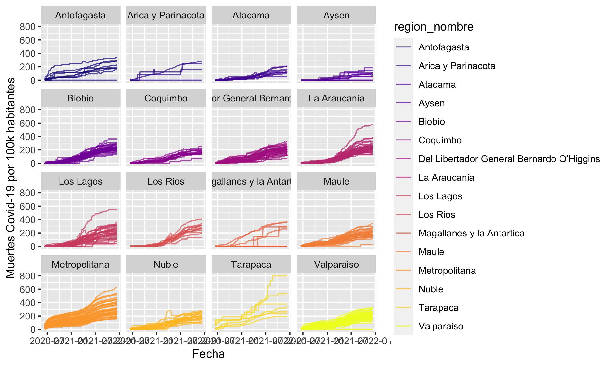
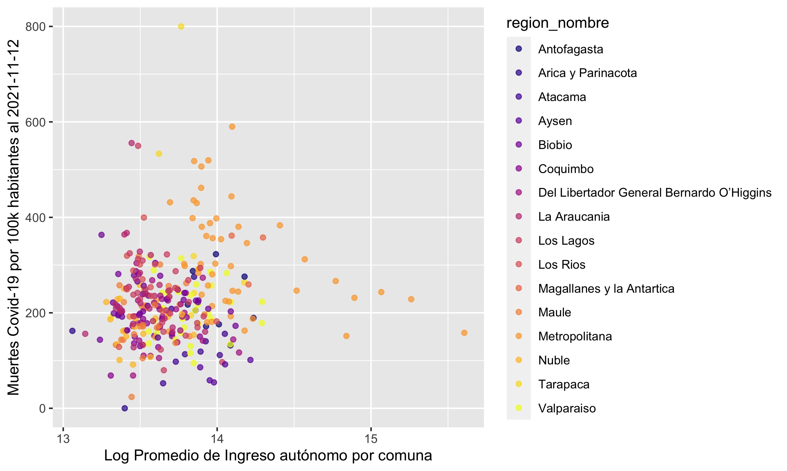

```{r, echo=FALSE, message=F}
# Escribir install.packages("tinytex") en la consola para instalar "tinytex"
# Carga "tinytex" para compilar PDF
library("tinytex")
library("tidyverse")
library("viridis")
library("stargazer")
```

## Introducción

El presente reporte resume la trayectoría y situación actual de las muertes atribuibles a Covid-19 en las diferentes comunas de Chile. 

## Datos

Los datos utilizados reportan el número de casos fallecidos en cada una de las comunas de Chile y concatenan la historia de los informes epidemiológicos publicados por el Ministerio de Salud. Estos datos pueden ser descargados desde el [repositorio github  del ministerio](https://github.com/MinCiencia/Datos-COVID19/blob/master/output/producto38/CasosFallecidosPorComuna.csv).

Además, el análisis fue suplementado con información a nivel comunal derivada de la [Encuesta de Caracterización Socioeconómica 2017](http://observatorio.ministeriodesarrollosocial.gob.cl/encuesta-casen-2017#basedatos)

Usando la función `stargazer()` en combinación con loops se creó una tabla como la siguiente para cada región del país separadamente. Estas tablas deberán ser almacenadas en la carpeta `tf\resultados\`. NO es necesario que insertes dichas tablas (ni la mostrada a continuación) en tu reporte.

```{r, echo=FALSE, message=FALSE, warning=FALSE}
folder <- "~/Library/Mobile Documents/com~apple~CloudDocs/Teaching/ISUC/2021_2_data_analysis_r/hw_ans/tf_answers/"
dircodigo       <- paste0(folder,"codigo/") 
dirdatos	    <- paste0(folder,"datos/") 
dirresultados   <- paste0(folder,"resultados/")

setwd(dirdatos)
covid_comunas <- read_csv("covid_comunas.csv")

 covid_comunas %>% select(Poblacion, edad, esc,ytotcorh, `2020-06-12`,`2021-11-12`) %>%
 	as.data.frame() %>%
	stargazer(summary.stat = c("n", "mean","median", "sd"), 
		covariate.labels  = c("Población", "Edad", "Escolaridad","Ingreso total hogar", "Muertes por 100k hbs al 2020-06-12",  "Muertes por 100k hbs al 2021-11-12"),
		type = "text")

```

## Métodos 

Se utilizó una combinación de métodos descriptivos y visualización de datos.


## Resultados

Las figuras a continuación muestran el aumento en el tiempo de las muertes acumuladas por Covid-19 y su posterior estancamiento. Dicha tendencia se observa en todas las comunas del país pero a ritmos y niveles áltamente heterogeneos.



Adicionalmente, se observa una cierta asociación entre el nivel de riqueza de las comunas y la cantidad de muertes acumuladas por Covid-19.




## Discusión

Los resultados de éste estudio sugieren que el proceso de vacunación ha sido de gran ayuda.  

